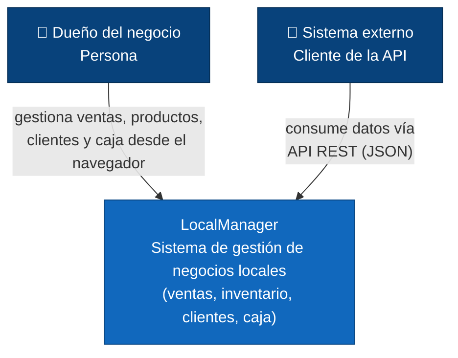

# C4 Nivel 1 — Contexto — LocalManager

**Para quién es:** cualquier persona, técnica o no técnica (stakeholders, negocio, nuevos integrantes del equipo).

**¿Quién usa el sistema y qué hace el sistema, en términos simples?** Nadie en esta vista necesita saber que existe ASP.NET Core, Clean Architecture, ni los patrones GOF (Repository/Strategy) usados internamente.