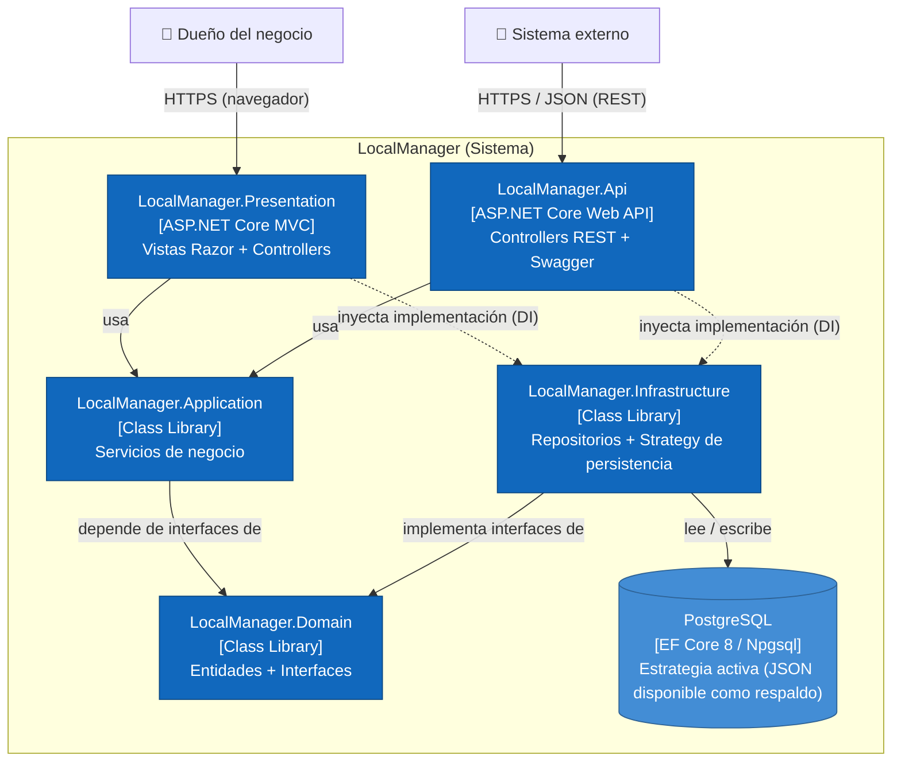

# C4 Nivel 2 — Contenedores — LocalManager

**Para quién es:** el equipo técnico (desarrolladores, arquitectos) que necesita entender cómo se despliega y comunica el sistema.

**¿Cuáles son las piezas técnicas grandes del sistema (los 5 proyectos de la solución + persistencia) y cómo se comunican entre sí?** Aquí ya aparece la regla de dependencia de Clean Architecture: `Domain` no conoce a nadie, y tanto `Presentation` como `Api` solo hablan con `Application` (y resuelven `Infrastructure` por inyección de dependencias, nunca de forma directa).

> **Actualización (ADR-08):** la Deuda técnica 1 del ADR-06 quedó pagada — el patrón Strategy sobre `IDbContext` ahora sí selecciona un motor distinto según `UseJsonPersistence`. La estrategia activa en desarrollo y en el despliegue es **PostgreSQL** (vía EF Core / Npgsql), y `JsonDbContext` queda disponible como estrategia alternativa sin motor de base de datos.