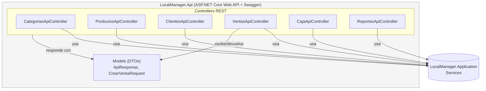

# C4 Nivel 3 — Componentes — dentro de LocalManager.Api

**Para quién es:** desarrolladores que consumen o extienden la API REST (equipos de integración, apps móviles futuras).

**¿Qué expone la API y cómo da servicio a sistemas externos?** Cada `*ApiController` mapea una entidad de negocio, delega en `LocalManager.Application` y devuelve respuestas estandarizadas mediante los DTOs de `Models` (`ApiResponse`, `CrearVentaRequest`), documentadas automáticamente por Swagger/OpenAPI.