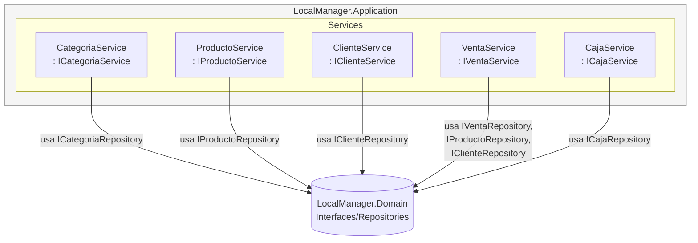

# C4 Nivel 3 — Componentes — dentro de LocalManager.Application

**Para quién es:** desarrolladores que implementan o modifican reglas de negocio.

**¿Dónde vive la lógica de negocio y de qué depende?** Cada servicio recibe **solo interfaces** de `Domain` (nunca implementaciones concretas de `Infrastructure`), lo que garantiza que `Application` pueda cambiarse de persistencia (JSON ↔ SQL Server) sin tocar una sola línea de este proyecto.