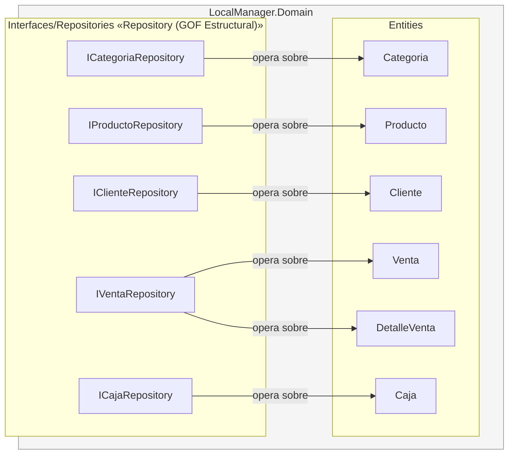

# C4 Nivel 3 — Componentes — dentro de LocalManager.Domain

**Para quién es:** desarrolladores que van a modificar entidades o contratos de acceso a datos.

**¿Qué hay dentro del centro de la arquitectura?** `Domain` es el proyecto que no depende de ningún otro (ni `Infrastructure`, ni `Presentation`, ni `Api`) y define, en las interfaces `I*Repository`, el contrato del patrón **Repository** (GOF, Estructural) que `Infrastructure` implementará más adelante.