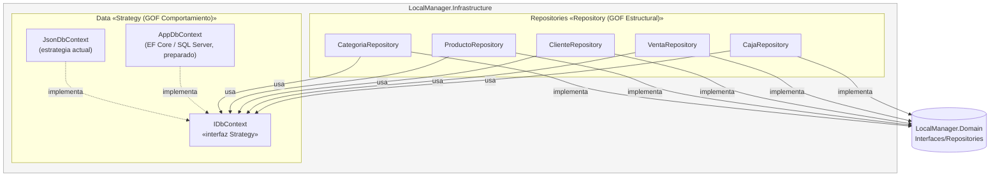

# C4 Nivel 3 — Componentes — dentro de LocalManager.Infrastructure

**Para quién es:** desarrolladores que trabajan en persistencia o van a habilitar SQL Server.

**¿Cómo se guardan los datos y cómo se puede cambiar el mecanismo sin romper nada?** Aquí conviven los dos patrones GOF del ADR-05: **Repository** (los `*Repository` implementan las interfaces de `Domain`) y **Strategy** (`IDbContext` permite intercambiar `JsonDbContext` por `AppDbContext` con una sola línea en `appsettings.json`, sin tocar repositorios ni servicios).