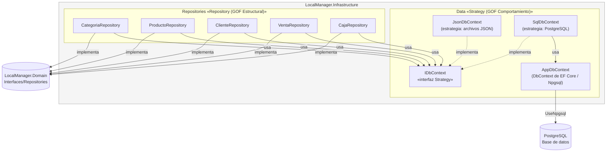

# C4 Nivel 3 — Componentes — dentro de LocalManager.Infrastructure

**Para quién es:** desarrolladores que trabajan en persistencia o que dan mantenimiento a la conexión con PostgreSQL.

**¿Cómo se guardan los datos y cómo se puede cambiar el mecanismo sin romper nada?** Aquí conviven los dos patrones GOF del ADR-05: **Repository** (los `*Repository` implementan las interfaces de `Domain`) y **Strategy** (`IDbContext` permite intercambiar `JsonDbContext` por `SqlDbContext` con una sola línea en `appsettings.json` — `UseJsonPersistence` —, sin tocar repositorios ni servicios).

> **Actualización (ADR-08):** `SqlDbContext` ya no es un componente "preparado" sino la estrategia **activa**. No implementa el acceso a PostgreSQL directamente: envuelve a `AppDbContext` (el `DbContext` real de Entity Framework Core, configurado con el proveedor `Npgsql`) y traduce sus operaciones al contrato `List<T> Set/Add/Update/Remove/Find/SaveChanges` que ya esperaban los repositorios desde el ADR-05. Ningún repositorio cambió una sola línea para lograr esto — es la prueba en código de que el patrón Strategy cumple su propósito.