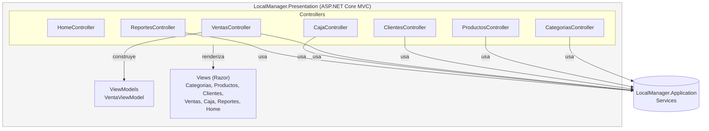

# C4 Nivel 3 — Componentes — dentro de LocalManager.Presentation

**Para quién es:** desarrolladores frontend/MVC que trabajan en las vistas Razor y su interacción con el dueño del negocio.

**¿Cómo está organizado el sitio web que usa el dueño del negocio?** Cada `Controller` (uno por entidad de negocio) solo conoce `LocalManager.Application` — nunca accede directamente a `Infrastructure` ni a los archivos de persistencia — y delega en `Application` toda la lógica antes de renderizar las vistas Razor.